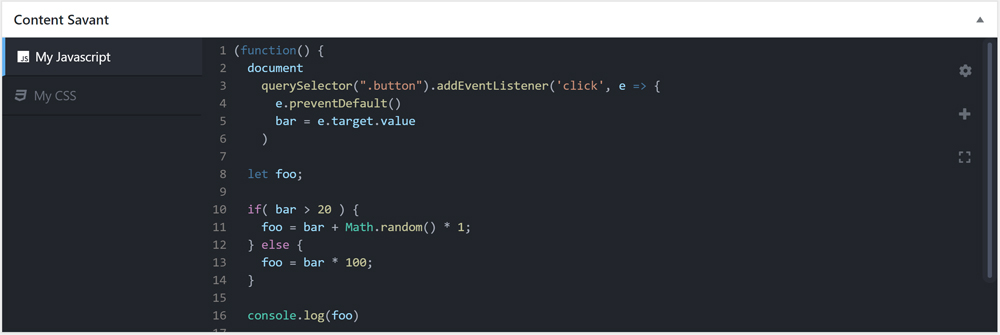

# Content Savant

Adds an interface to add Javascript or CSS on a per page basis via a syntax highlighting configurable code editor or file upload.

## Getting Started

These instructions will get you a copy of Content Savant up and running in no time.

### Prerequisites

- An install of WordPress

### Installation

Place the included folder into the wp-content/plugins directory of a Wordpress install or upload it via Plugins in the WordPress Admin. Activate the plugin via the Wordpress Admin.

### Usage

Once activated a new metabox with a text editor will become available on post edit pages in the admin. Simply add your first script by completeing the options on the form and hitting add new. You can add more CSS or Javascript scripts by selecting the + icon to the right of the interface and entering the configuration.

### Settings

Settings for Content Savant (Savant Settings) can be found under the settings tab in the admin.

Currently there are settings for:

- Post types to use Content Savant with
- Basic Editor Settings to configure CodeMirror namely Mode type and Theme (More to be added in future versions)
- Options to minify code when output to DOM (Editor only)
- Boilerplate code for new scripts

## Built With

- [CodeMirror](https://codemirror.net/) - In browser text editor
- [Font Awesome](https://fontawesome.com/) - Icon set and toolkit

## Contributing

Want to contribute? Great!

1. Fork it.
2. Create a branch (`git checkout -b my_markup`)
3. Commit your changes (`git commit -am "Added Snarkdown"`)
4. Push to the branch (`git push origin my_markup`)
5. Open a Pull Request
6. Done!

## Authors

- **Aidan Hislop** - _Initial work_ - [github.com/amhislop](https://github.com/amhislop)
